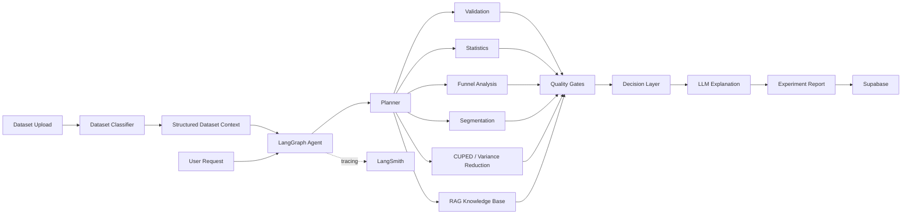

# Experiment Review Copilot

### AI Decision Support System for Product Experimentation

Experiment Review Copilot is an AI agent that helps **product and data analysts** review experiments and make structured, evidence-based decisions from raw experiment data.

The agent automates experiment validation, statistical analysis, segmentation, funnel analysis and methodology lookup, while keeping calculations deterministic and explainable.

🔗 **Live demo:** https://ai-decision-support-system.vercel.app/

---

## Architecture



---

## Core Workflow

```text
Upload
  ↓
Dataset Classification
  ↓
LangGraph Agent
  ↓
Plan → Select Tool → Execute → Receive Result
  ↓
Validation & Quality Gates
  ↓
Decision
  ↓
LLM Explanation
  ↓
Experiment Report
```

### Key principle

**The agent orchestrates. Python calculates. The LLM explains.**

The LLM does not calculate statistical results or p-values. Statistical analysis is performed deterministically with Python, SciPy and statsmodels.

---

## Function Tools

The agent can call multiple specialized tools:

* **Data Quality & Validation** — SRM, conflicting assignments, missing/invalid data
* **Statistical Analysis** — significance, confidence intervals, effect size
* **Power & MDE** — experiment power and minimum detectable effect
* **Segmentation** — compare experiment effects across segments
* **Funnel Analysis** — identify conversion drop-off points
* **CUPED / Variance Reduction** — evaluate variance reduction
* **Knowledge Base** — retrieve experimentation methodology

---

## RAG

The project includes an experimentation knowledge base based on materials from sources such as **Airbnb, Netflix, Microsoft, Booking.com and Kohavi's experimentation research**.

Retrieval uses:

**BM25 + Elasticsearch**

The retriever was evaluated using **Precision@K**, with a calibrated relevance threshold to improve retrieval quality.

The RAG layer is used for methodology questions rather than statistical calculations.

---

## Validation & Quality Gates

Critical experiment problems can stop the workflow before a statistical decision is produced.

For example:

```text
SRM detected
    ↓
Experiment marked INVALID
    ↓
No statistical decision
```

This prevents statistically significant results from an invalid experiment being presented as reliable evidence.

Possible decisions:

* **GO**
* **NO-GO**
* **INCONCLUSIVE**
* **INVALID**

---

## Memory

**Supabase / PostgreSQL** stores experiment history.

Users can:

**Store → Review → Delete**

This allows the application to keep previous experiment results instead of working as a stateless chatbot.

---

## Security & Observability

The application includes:

* prompt-injection protection
* dataset validation
* upload limits
* rate limiting
* error handling
* backend-only API secrets
* critical validation gates
* **LangSmith** tracing and monitoring

LangSmith is used to inspect agent execution, tool calls and LLM interactions.

---

## User Interface

The web interface provides:

* dataset upload
* experiment analysis
* user requests
* analytical results
* decision reports
* experiment history

The goal is to keep the workflow simple for users who do not need to understand the underlying LLM configuration.

---

## Testing

The project contains **700+ automated tests** covering:

* dataset classification
* statistical analysis
* validation
* decision logic
* agent workflows
* tools
* edge cases
* security
* rate limiting
* error handling

Run tests:

```bash
cd backend
python3 -m pytest tests/ -v
```

---

## Tech Stack

**Frontend:** Next.js 16, TypeScript, Tailwind CSS, shadcn/ui

**Backend:** Python, FastAPI, LangGraph

**Analytics:** pandas, NumPy, SciPy, statsmodels, scikit-learn

**AI:** OpenRouter, LangGraph

**RAG:** Elasticsearch, BM25

**Database:** Supabase / PostgreSQL

**Observability:** LangSmith

**Deployment:** Vercel + Render

---

## Requirements

### Core Requirements

| Requirement        | Implementation                                           |
| ------------------- | ---------------------------------------------------------|
| Agent purpose       | AI assistant for experiment review                       |
| Core functionality  | Validation, statistics, segmentation, funnel, CUPED, RAG |
| Function tools      | Multiple specialized analytical tools                    |
| User interface      | Web application with upload and analysis workflow        |
| Error handling      | Validation, quality gates, limits and error handling     |
| Documentation       | Architecture, setup, use cases and technical decisions   |

### Optional Tasks

* **Long-term memory** — Supabase experiment history
* **Security guard** — prompt-injection protection
* **Agentic RAG** — BM25 knowledge retrieval
* **LLM observability** — LangSmith
* **RAG evaluation** — Precision@K
* **Advanced agent workflow** — LangGraph multi-tool orchestration
* **Extensive testing** — 700+ automated tests

---

## Local Development

### Backend

```bash
cd backend
pip install -e .
uvicorn app.main:app --reload --port 8000
```

### Frontend

```bash
npm install
npm run dev
```

Create `.env.local`:

```env
NEXT_PUBLIC_API_URL=http://localhost:8000
```

---

## Technical Decisions

### Why deterministic analytics?

Statistical calculations must be reproducible and testable. Therefore, the LLM does not perform mathematical calculations.

### Why LangGraph?

The analysis requires multiple steps and tools. LangGraph provides explicit agent orchestration instead of one large prompt.

### Why BM25?

The knowledge base is focused on experimentation methodology. BM25 provides strong keyword-based retrieval without requiring external embedding APIs or unnecessary vector infrastructure.

### Why Supabase?

Supabase provides simple persistent storage for experiment history and application state.

---

## Future Improvements

* Data Hub for experiment datasets
* more complex experiment and metric types
* semantic RAG if the knowledge base grows
* stronger agent evaluation
* authentication and multi-user support
* production-scale infrastructure

---

## Project Goal

Experiment Review Copilot is designed to make experiment analysis **faster, more structured and more explainable**.

> **Agent → orchestrates**
> **Tools → calculate and validate**
> **RAG → provides methodology**
> **Decision layer → combines evidence**
> **LLM → explains**
> **Supabase → remembers**
> **LangSmith → observes**
