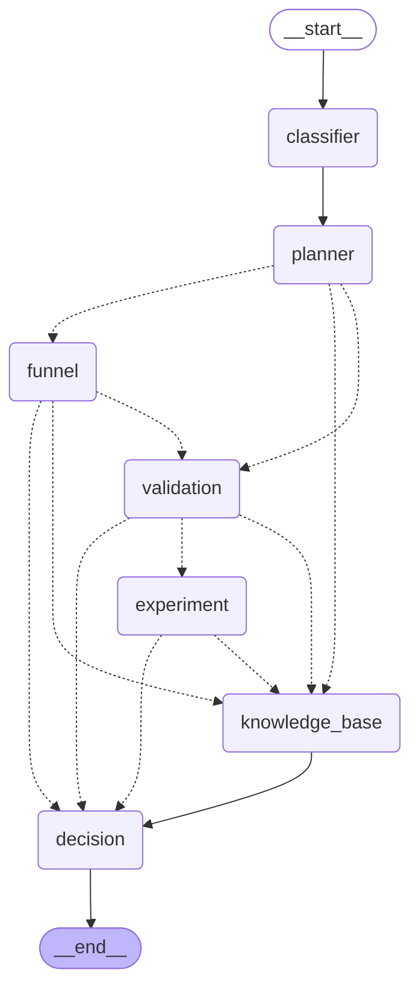

# Experiment Review Copilot — Backend

An AI Decision Support System for Product Experimentation. FastAPI +
LangGraph backend that classifies A/B test datasets, validates data
quality, runs deterministic statistical tests, and generates a
structured experiment report.

## Why LangGraph?

- The LLM is only responsible for planning (which capabilities to run)
  and interpreting/narrating results — never for calculations.
- Every statistic (SRM, hypothesis tests, power analysis, CUPED,
  bootstrap) is a deterministic Python function in `app/stats/`,
  independently unit-tested with zero LLM involvement.
- LangGraph orchestrates capability routing: Planner decides *which*
  nodes a request needs, and Validation can halt the pipeline before
  a hypothesis test ever runs on untrustworthy data (a failed Sample
  Ratio Mismatch check skips Experiment entirely).
- Swapping the report generator from a template to an LLM
  changes one factory function (`get_report_generator()`) — the graph
  topology, nodes, and API contract don't change.

## Graph



Four independent conditional decisions make the graph *routing* agentic
(not the retrieval strategy itself — see the terminology note in
"Knowledge Base (RAG)" below) rather than a fixed pipeline:

**After `planner`** — decides which of three entry paths a request takes:

- **Conceptual question** (e.g. "What is CUPED?", with no reference to
  "this dataset") and NO funnel signal → route directly to
  `knowledge_base`, skipping everything else. This is the pure Agentic
  RAG entry: `knowledge_base` is the ONLY capability, so it's exclusive.
  See "Knowledge Base (RAG)" below.
- **Funnel/drop-off question** (e.g. "why did conversion decrease?",
  "where are users dropping off?") → route to `funnel` first, whether
  alone or combined with validation/experiment (the "did variant B fix
  the drop-off?" case — see "Funnel Analysis" below).
- **Otherwise** → `validation` runs as normal.

**`knowledge_base` as a shared waypoint, not just an entry path.** A normal "should we ship?" request selects
`["validation", "experiment", "knowledge_base"]` together — Planner no
longer treats retrieval as mutually exclusive with the statistical
path. `knowledge_base` isn't a fourth branch off the Planner in this
case; every statistical/funnel exit toward `decision` first checks
whether Planner also asked for methodology and, if so, detours through
`knowledge_base` on the way there (see `_needs_knowledge_base` in
`graph_builder.py`). Concretely:

- **After `funnel`** — if Planner ALSO selected `validation`, continue
  into `validation`/`experiment` as normal. Otherwise, if `knowledge_base`
  was also requested, stop there before `decision`; if not, go straight
  to `decision` with just the funnel numbers.
- **After `validation`** — SRM failure, conflicting variant duplicates,
  or Planner having excluded `experiment` all still stop the pipeline
  early (running a hypothesis test on broken/untrustworthy data would
  produce a misleading number), but each of these now also detours
  through `knowledge_base` first if it was requested — a broken-
  randomization report benefits from methodology explaining *why* it
  can't be trusted, not just a bare confidence label. Otherwise →
  `experiment` runs as normal.
- **After `experiment`** — the main "should we ship?" path — detours
  through `knowledge_base` before `decision` whenever Planner requested
  it. This is the case that most benefits from methodology actually
  reaching the report.

Because `knowledge_base_node` runs AFTER validation/experiment on this
path (not before, as on the conceptual-only entry), its retrieval query
is enriched with the facts that were just computed — SRM failed?
underpowered? which test ran? — not just the raw prompt, so a question
like "should we ship variant B?" (almost no term overlap with the
knowledge base on its own) still retrieves the right guidance (e.g.
"underpowered experiments", "sample ratio mismatch"). See
`knowledge_base_node.py::_build_query`.

Regenerate the diagram after any change to `graph_builder.py`:

```bash
python3 scripts/export_graph.py
```

This dumps the diagram directly from the compiled LangGraph object
(`.get_graph().draw_mermaid()`), so it can never drift from what the
graph actually does — it's not hand-drawn.

## Funnel Analysis

A second Product Analytics capability alongside Experiment Review —
step-by-step conversion and drop-off across a multi-step user journey
(e.g. Visit → Signup → Trial → Purchase), fully deterministic
(`app/stats/funnel.py`), zero LLM involvement in the numbers.

**Architectural principle**: Classifier describes what's in a dataset
— it never requires the dataset to be suitable for every capability.
A funnel/event-log dataset (`user_id`, `event`, `timestamp`) has no
"metric" column at all, and that's fine; `experiment_columns` is
simply `None` in that case. Each capability node checks the columns
IT needs and fails with a clear, explained message — never a bare
`KeyError` — only if that capability actually gets routed to.

- `app/stats/funnel_classifier.py::detect_funnel_columns()` — detects
  event-log structure (user id + event with ≥2 distinct values +
  timestamp); returns `None` (not an error) for datasets that aren't
  funnels.
- `infer_step_order()` — orders distinct event values by median
  timestamp across the dataset, rather than hardcoding step names —
  general-purpose, not tied to any one funnel's step labels.
- `compute_funnel()` — strict step-over-step semantics: a user only
  counts as reaching step N if they also reached every step before it,
  in order (so step counts are always monotonically non-increasing —
  what "funnel" actually means).
- `compute_funnel_by_group()` — one funnel per experiment arm, which
  is what makes the combined "why did conversion decrease, and did
  variant B fix it?" use case possible.

### Derived conversion metric — the bridge to Experiment Review

When a request combines funnel + experiment (e.g. "why did conversion
decrease, and did variant B fix it?") and the dataset has **no**
separate metric column — just a raw event log — the agent doesn't
fail. `derive_conversion_dataframe()` builds one from the funnel data
itself: **conversion is defined as reaching the final funnel step**,
using the exact same strict step-over-step semantics as the funnel
computation, so the two analyses are guaranteed to agree with each
other (they're two views of the same underlying definition, not two
independent numbers that happen to match). This is real analytical
logic, not a UI convenience — see `funnel_node.py` for how it swaps
`GraphState`'s `dataset_id`/`experiment_columns` to point at the
derived data before Validation/Experiment run.

### Example: Combined Funnel + Experiment Analysis

This is the flagship use case — a question that needs BOTH
capabilities, routed and connected automatically:

> **User:** "Why did conversion decrease, and did variant fix it?"

```
Classifier → Planner → Funnel → Validation → Experiment → Decision
```

Real output from the demo funnel dataset (`data/demo/demo_funnel.csv`,
8,000 users, Visit → Signup → Trial → Purchase):

- **Largest drop-off:** Trial → Purchase (71.7% of users lost)
- **Control conversion:** 9.53% (reached Purchase)
- **Variant conversion:** 13.90%
- **Statistical significance:** Chi-square, p = 1.45×10⁻⁹ (significant)
- **Funnel drop-off by arm:** control lost 76.5% at Trial → Purchase, variant lost 67.3%

Executive summary the agent actually produced:

> "Analysis of 8,000 users across 2 variants found a statistically
> significant effect on Conversion Rate. [...] Funnel analysis found
> the largest drop-off at Trial → Purchase (71.7% of users lost).
> Comparing arms: control lost 76.5% at Trial → Purchase, vs. variant
> at 67.3% at Trial → Purchase."

Note that the funnel's conversion numbers (9.53%/13.90%, derived from
"reached Purchase") and the experiment's chi-square test ran on
**that exact same derived metric** — this isn't two independent
analyses that happen to agree, it's one metric computed once and used
by both capabilities.

## Knowledge Base (RAG)

A small, deliberately dependency-light retrieval layer: `docs/knowledge_base/`
holds six short markdown files (SRM, CUPED, guardrail metrics, test
selection, sequential testing, segment heterogeneity, iteration
velocity, A/A tests, and more) and
`app/rag/retriever.py` retrieves from them with a from-scratch TF-IDF +
cosine-similarity implementation — no Chroma, no embeddings API, no
network call, fully deterministic and unit-tested. RAG is used as an
experimentation methodology layer alongside deterministic statistical
analysis — it explains and justifies a recommendation, it never
computes one.

| Source | Primary use |
|---|---|
| Kohavi | experimentation methodology, pitfalls (Twyman's Law, SRM, MDE/power), decision-making |
| Microsoft ExP | statistical test selection (Welch/Student's t, chi-square/Fisher's), confidence intervals |
| Netflix | variance reduction (CUPED), sequential testing, bootstrap confidence intervals |
| Booking.com | guardrail metrics, holdout groups, multiple comparisons, experimentation velocity |
| Airbnb | segment-level heterogeneity, iteration speed vs. rigor |
| Optimizely / Google | statistical vs. practical significance, one-sided vs. two-sided tests, A/A tests as a sanity check |

Each source was deliberately scoped to a distinct topic to avoid two
chunks competing for the same query (see the retrieval-evaluation note
below) — the corpus is 6 sources, not dozens, on purpose.

Note on terminology: this is conditional retrieval + LLM context, not
a fully *agentic* RAG. Planner decides WHETHER to retrieve (based on
the request's capability set), but the retriever itself doesn't plan,
reformulate its own query, run multiple retrieval hops, or self-
critique its results — `knowledge_base_node` is a single, deterministic
retrieve-once call. "Agentic" here describes the graph's conditional
routing (see "Graph" above), not the retrieval strategy itself.

This is still "retrieve only when needed," not "always stuff context
into every prompt": `knowledge_base` is a graph node that only runs when
`planner`'s selected capabilities ask for it. Ask "what is CUPED?" and
`validation`/`experiment` never run at all — pure conceptual questions
still get an exclusive, retrieval-only path. But ask "evaluate my
experiment" / "should we ship?" and retrieval also runs there:
`knowledge_base` is a shared waypoint on the statistical path too,
not just an exclusive alternative to it (see "Graph" above).

**From citations to reasoning.** A retrieved Kohavi/Microsoft/
Netflix/Booking chunk reaches the main statistical report, not just
the conceptual-question path — `route_after_planner` does NOT treat
`knowledge_base` as exclusive with `validation`/`experiment`:

- `PlannerLLMResponseModel`/`KeywordPlanner` can select
  `["validation", "experiment", "knowledge_base"]` together.
- `knowledge_base_node` runs AFTER validation/experiment when reached
  this way, so its query is enriched with the actual computed facts
  (SRM failed? underpowered? which test?), not just the raw prompt —
  see `_build_query`.
- `TemplateReportGenerator._methodology_recommendation()` and
  `LLMReportGenerator`'s system prompt both now consume
  `facts.kb_results`: the template path appends one grounded
  recommendation line pointing at the top retrieved source; the LLM
  path gets a full `METHODOLOGY / EXPERIMENTATION GUIDANCE` block with
  explicit instructions to use it only to *explain* the recommendation
  — never to invent or override any number.
- The deterministic boundary is unchanged: `stats`, `mde`,
  `sample_size_note`, `quality_checks`, and `confidence`/`confidence_stars`
  are still copied straight from `ReportFacts` on both paths, byte-
  identical whether or not methodology was retrieved (see
  `tests/llm/test_llm_report_generator.py::TestLLMReportGeneratorMethodologyContext`
  and `TestTemplateReportGeneratorMethodologyContext`).
- A retrieval outage (`get_retriever()`/`retrieve()` raising) degrades
  to `kb_results=[]` inside `knowledge_base_node` itself and logs a
  warning — it never takes down an otherwise-valid experiment report.

A retrieval miss (no chunk scores above the relevance threshold, or a
RAG outage) returns an empty reference list rather than forcing a
low-quality or fabricated match — the report simply omits the
methodology section instead of citing something irrelevant.

**Evaluation is two layers, not one.** Retrieval quality (did we find
the right chunk?) says nothing about decision quality (did the agent
reach the methodologically correct ship/no-ship recommendation, and
stay grounded in the facts while doing it?) — these are evaluated
separately, matching the retrieval / context / decision breakdown
below.

**Layer 1 — Retrieval evaluation**: `scripts/evaluate_retrieval.py` runs 24
paraphrased queries (never reusing a chunk's exact heading text)
against the real knowledge base and reports Hit@1, Hit@3, MRR, NDCG@3,
and latency. Currently 79.2% Hit@1 / 87.5% Hit@3 / 0.833 MRR / 0.844
NDCG@3, sub-millisecond latency. The 3 known misses are documented in
`tests/rag/test_retrieval_eval.py` — abstract paraphrases with
genuinely low lexical overlap with the target chunk, an honest
tradeoff of TF-IDF's lack of semantic understanding (vs. an
embeddings-based retriever, which was deliberately not used — see "Why
LangGraph?" tradeoffs above). MRR/NDCG@3 exist alongside Hit@1/Hit@3
because Hit@3 alone can't distinguish "correct chunk ranked 1st" from
"correct chunk ranked 3rd" — both count as a Hit@3, but only the first
is what a user actually sees without scrolling. This evaluation is
also a regression guard, and not a hypothetical one: it caught a real
79.2%→70.8% Hit@1 regression during development, when two new
knowledge-base sources were added with topics that overlapped existing
ones (see the `airbnb.md`/`optimizely_google.md` "avoid duplicate
topics" note above) — the corpus was fixed until the floor was
restored, rather than lowering the floor.

**Layer 2 — Decision evaluation**: `scripts/evaluate_decisions.py` runs
15 expert-labeled A/B-testing scenarios (SRM failure, broken variant
assignment, underpowered null result, borderline p-value, negative
significant effect, stacked quality issues, funnel-only, and more)
directly against `TemplateReportGenerator` and checks three things:
Decision Accuracy (does `report.confidence` match the label an
experienced Product Analyst would assign?), Numerical Consistency
(are `stats`/`mde`/`sample_size_note` copied through byte-identical
from `ReportFacts`, never silently altered?), and Unsupported
Recommendation Rate (does the report ever cite a methodology source
when `kb_results` was empty?).

> On a 15-scenario expert-labeled regression set, the deterministic
> decision layer achieved 100% decision accuracy, 100% numerical
> consistency, and 0% unsupported recommendations.

This is a regression guard, not a claim of production-level model
accuracy — 15 scenarios is a small, hand-built set, and the decision
logic under test is deterministic Python, not a trained model, so
"100%" here means "matches the 15 rules it was written against,"
not "correct 100% of the time on real-world experiments." What IS a
meaningful guarantee: unlike retrieval quality (where <100% is
expected — see Layer 1), there's no legitimate reason for
deterministic decision logic to regress on scenarios it already
covers, so a drop below 100% here means an actual code bug, not
statistical noise to threshold-tune away. All three metrics are held
at their exact current value in `tests/graph/test_decision_eval.py`.

This intentionally runs against `TemplateReportGenerator`, not a live
LLM call graded by another LLM — it needs to be fast, deterministic,
and CI-safe. `LLMReportGenerator` reuses the exact same
`_assess_confidence`/`_recommendations` decision rules via composition
for its confidence level (see `LLMReportGenerator.generate`), so this
evaluation covers the part of the decision that's guaranteed identical
on both paths; what the LLM path adds beyond this is narration
quality, not decision logic. A live LLM-as-a-judge setup for narration
quality (faithfulness, answer relevance, citation correctness) was
deliberately scoped out for now in favor of this smaller, deterministic
set — see `scripts/evaluate_decisions.py`'s module docstring.

```bash
python3 scripts/evaluate_retrieval.py
python3 scripts/evaluate_decisions.py
```

## CUPED

CUPED (Controlled-experiment Using Pre-Experiment Data — `app/stats/variance_reduction.py`)
is a real, correct implementation — `apply_cuped()` computes
`theta = Cov(Y, X) / Var(X)` and adjusts each arm's metric by
`Y - theta * (X - mean(X))` on the paired non-null observations,
auto-detects a usable pre-experiment covariate by column-name pattern
(`{metric}_pre`, `pre_{metric}`, `_baseline`, `_historical`, etc.),
and skips gracefully with an explained reason when no such covariate
exists or it's too weakly correlated to help — never a silent no-op or
a crash.

**It's also genuinely demonstrated, not just implemented.** None of
the dataset shipped for the rest of the app (`demo_ab_checkout.csv`,
its low-quality variant, the funnel/raw-event datasets) has a
covariate column, so toggling CUPED against any of those always hits
the honest "skipped — no covariate found" path — the math would
otherwise only ever be exercised by synthetic unit-test fixtures, never
by anything a user could actually load. `data/demo/demo_ab_aov_cuped.csv`
closes that gap: 6,000 users, a continuous `order_value` metric, and a
real, correlated (r ≈ 0.90) `order_value_pre` covariate. Measured
end-to-end through the real graph (`tests/graph/test_cuped_e2e.py`):

| | CUPED off | CUPED on |
|---|---|---|
| Variance | baseline | **81% reduced** |
| 95% CI width | $2.63 | **$1.13** (2.3× tighter) |
| p-value | 7.6×10⁻⁷ | **2.7×10⁻³⁰** |
| Point estimate (control/variant means) | unchanged | unchanged |

The point estimates staying identical while the CI tightens and the
p-value drops by 23 orders of magnitude is exactly the expected CUPED
signature — it's an unbiased variance-reduction technique, not a
different estimate of the effect. `test_cuped_e2e.py` also proves the
full real path: an actual HTTP file upload through `/datasets/classify`,
followed by `/experiments/analyze` with `cuped: true`, whose returned
report's `next_steps` explains the applied reduction in plain language
— not an internal-only fixture.

## Guardrail Metrics

**MVP scope, stated plainly: this supports exactly ONE explicitly
recognized guardrail metric — `error_rate` — not general multi-metric
experimentation.** `detect_guardrail_column()`
(`app/stats/dataset_classifier.py`) looks for that one column name,
case-insensitively; it is not a candidate list and does not infer
"which column looks like a guardrail." A dataset without an
`error_rate` column behaves exactly as before this feature existed —
`guardrail_check` is `None` and no guardrail-related text appears
anywhere in the report (`data/demo/demo_ab_guardrail_regression.csv`
is the one demo dataset that has this column; every other demo
dataset does not).

**What it does:** when `error_rate` is present, `experiment_node.py`
runs it through the exact same `select_test()`/`compute_stat_result()`
machinery as the primary metric — same control/variant assignment, no
special-cased statistics — and evaluates Booking.com's stated rule
(`docs/knowledge_base/booking.md`): a primary-metric win alongside a
significant `error_rate` increase is flagged (`GuardrailCheck.flagged
= True`) as needing its own sign-off before shipping. `error_rate` is
treated as "higher is always worse" — a business-rule assumption
specific to this one metric, not something the system infers; a
significant *decrease* (an improvement) is correctly never flagged
(verified directly, not just by reading the code — see below).

**What it deliberately does NOT do:** a flagged guardrail regression
does **not** change `ExperimentReport.decision` (`ShipDecision`).
`_decide()` never reads `guardrail_result` — this was verified by
running it twice on identical facts, once with the guardrail result
populated and once with it forced to `None`, producing byte-identical
decisions both times, not just confirmed by inspection. This is a
deliberate, currently-open scope boundary: whether a guardrail
regression should be able to flip a decision to `do_not_ship`
automatically is a separate design decision for a future pass, not
something this MVP silently assumes.

Live-verified numbers (not hypothetical) from
`data/demo/demo_ab_guardrail_regression.csv`:

| | Primary (Conversion Rate) | Guardrail (Error Rate) |
|---|---|---|
| Control | 3.96% | 0.02 |
| Variant | 5.04% | 0.03 |
| Delta | +27.3% | +60.0% |
| p-value | 0.00026 | ≈0 |
| Significant | Yes | Yes |

→ `flagged = True`, `decision = ship` — a real, intentional
intermediate state: the primary metric result stands on its own, and
the guardrail is surfaced as a required sign-off, not silently folded
into the same number.

A second scenario on the same dataset shape but a *healthy* guardrail
(no `error_rate` regression) produced `decision = inconclusive` even
though the primary metric was significant (p=0.011, +24.2%) — because
the observed effect (24.2%) fell below the MDE the experiment was
powered to detect (26.3%) at this sample size. This is the practical-
significance guard from the CUPED/decision-correctness work above
doing its job, not a guardrail-related effect — confirmed by tracing
the exact `_decide()` branch taken (`significant and positive, but
`abs(delta_relative) < mde``) and cross-checking the underlying
`power_analysis` facts directly.

The LLM path (`LLMReportGenerator`) receives the computed
`GuardrailCheck` as disclosed, read-only context in its prompt — with
an explicit instruction that it may narrate but never override it —
and reuses the exact same deterministic object rather than letting the
LLM construct its own; this was verified with a test that feeds the
LLM path a deliberately adversarial fake response (trying to invent a
different recommendation) and confirms the returned `guardrail_check`
is still byte-identical to the template path's.

## Architecture


```
app/
├── main.py                  # FastAPI app, CORS, routers
├── core/
│   ├── config.py             # statistical thresholds, REPORT_BACKEND, env settings
│   └── logging.py            # per-node structured logging ([Classifier], [Planner], ...)
├── schemas/                  # Pydantic models mirroring the frontend's types.ts exactly
├── stats/                    # pure, deterministic, unit-tested — NO LLM, NO LangChain
│   ├── dataset_classifier.py
│   ├── srm.py
│   ├── quality_checks.py
│   ├── hypothesis_tests.py   # select_test() — the single deterministic test-selection entry point
│   ├── power_analysis.py
│   ├── variance_reduction.py # CUPED + bootstrap
│   ├── funnel.py              # step-over-step conversion/drop-off
│   └── funnel_classifier.py   # event-log detection + step-order inference
├── graph/
│   ├── state.py               # GraphState — one writer per field
│   ├── graph_builder.py       # StateGraph wiring + conditional routing
│   ├── report_generator.py    # Strategy: TemplateReportGenerator or LLM, selected via REPORT_BACKEND
│   ├── planner_strategy.py    # Strategy: KeywordPlanner or LLM, selected via PLANNER_BACKEND
│   └── nodes/                 # thin adapters — orchestrate app/stats/* and app/rag/*, no logic here
├── rag/
│   └── retriever.py           # TF-IDF + cosine similarity, no external API
├── llm/
│   └── client.py               # get_llm() — single OpenRouter/LangChain client factory
└── api/
    ├── routes_datasets.py     # POST /datasets/classify
    └── routes_experiments.py  # POST /experiments/analyze, POST /experiments/{id}/chat

docs/knowledge_base/            # kohavi.md, booking.md, netflix.md, microsoft.md, airbnb.md, optimizely_google.md — the RAG corpus
```

## Running

```bash
pip install -e .
uvicorn app.main:app --reload
```

## Using a Real LLM

`PLANNER_BACKEND=llm` and `REPORT_BACKEND=openrouter` (`.env`) switch
the graph from `KeywordPlanner`/`TemplateReportGenerator` to real
OpenRouter-backed strategies:

```
OPENROUTER_API_KEY=your-key-here
LLM_MODEL=anthropic/claude-3.5-sonnet
PLANNER_BACKEND=llm
REPORT_BACKEND=openrouter
```

**Architectural boundary, enforced in code, not just documentation:**
the LLM never sees the raw dataset — `LLMPlanner` receives only the
user's prompt and `DatasetInfo` (type/variant count/user count/metric
label); `LLMReportGenerator` receives only already-computed
`ReportFacts` (formatted stat strings, p-values, quality check
results). Neither ever gets a DataFrame. `confidence`/`confidenceStars`
are computed by the same deterministic `_assess_confidence()` logic in
both the template and LLM paths — the LLM narrates a pre-decided
confidence level, it never sets one. `stats`, `mde`, `sampleSizeNote`,
and `qualityChecks` are copied verbatim from Python-computed facts
onto the final report regardless of backend.

If the LLM call fails for any reason (missing key, network error,
malformed response), both `LLMPlanner` and `LLMReportGenerator` fall
back to their deterministic counterparts and log why — a request never
fails just because the LLM call did.

This is verified two ways:
- **Unit level** (`tests/llm/`, 11 tests, no network): mocks
  `get_llm()` to test structured-output handling, the numeric
  boundary, and fallback behavior.
- **End-to-end against a real model**: set the env vars above with a
  real key and run `/experiments/analyze` — every node, including the
  LLM calls, will show up as a LangSmith trace if tracing is also
  configured (see "Observability" above).

## Observability

The application supports [LangSmith](https://smith.langchain.com) tracing. Because
LangGraph's compiled graph is a LangChain Runnable, every
`/experiments/analyze` call becomes a single trace, with each node
(Classifier, Planner, Validation, Experiment, Decision) automatically
appearing as a child run — no extra instrumentation code needed for
that structure.

Tracing is enabled only when both of these are set:

```
LANGCHAIN_TRACING_V2=true
LANGSMITH_API_KEY=your-key-here
```

If `LANGSMITH_API_KEY` is empty, tracing is **force-disabled** —
regardless of what `LANGCHAIN_TRACING_V2` says — so the application
runs identically for anyone who clones the repo without a LangSmith
account. This is enforced in `app/core/tracing.py`, not left to
LangChain's own defaults.

LangSmith is observability only. It never influences routing,
statistics, or report content — those stay fully deterministic
(`app/stats/`) regardless of whether tracing is on.

## Testing

```bash
python3 -m pytest tests/ -v
```

## Known Limitations

- The frontend's `components/workspace-view.tsx` (`runEvaluation`,
  `handleFollowUp`) currently calls local `lib/mock-data.ts` canned
  reports (`HIGH_CONFIDENCE_REPORT`/`LOW_CONFIDENCE_REPORT`) rather
  than the real `frontend/lib/api.ts` client — the UI is not yet
  wired to live backend output.
- No backend-persisted session history yet; history is session-local
  on the frontend (`components/history-view.tsx`).
- Token usage / cost tracking (`Settings.costUsd`) exists in the
  schema but isn't computed anywhere yet.
- No Planner-level intent filter rejecting non-experimentation
  requests.
- Multi-model support is architecturally ready (`LLM_PROVIDER`/
  `LLM_MODEL` config + `get_llm()` factory) but not yet exercised
  against more than one real model.
